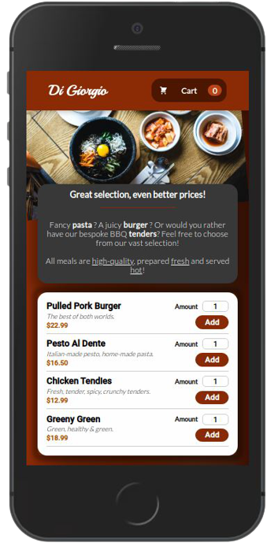

# Simple Restaurant Cart



A **React**-based, simple, fully-responsive, restaurant cart that allows adding/removing menu items with real-time price updates and featuring a very basic field-validation logic. The main premise of the project was to get familiar with Context and using it for app-wide state.

## Installation

As this project was bootstrapped with React, the following scripts are available:

**Install** the dependencies:

```
npm install
```

Launch the **test runner** in the interactive watch mode:

```
npm test
```

**Remove** the single build dependency from the project:

```
npm run eject
```

## Features

- Fully responsive
- Real-time price updates

## Tech

- React
- CSS Modules
- Context API

For a more detailed overview of the development & production dependencies, please check `package.json`.

## Live Version

<https://developedbygeo.github.io/Simple-restaurant-cart/>

## Contributing

Contributions are certainly welcome. Please feel free to open an issue/PR if there is something you would like to be changed.

## Acknowledgements

This app was created thanks to Maximilian Schwarzmüller & Academind for the awesome instructions and tips. Also a massive thank you to The Odin Project for their guidance and quality material.

## License

[MIT](./LICENSE.md)
